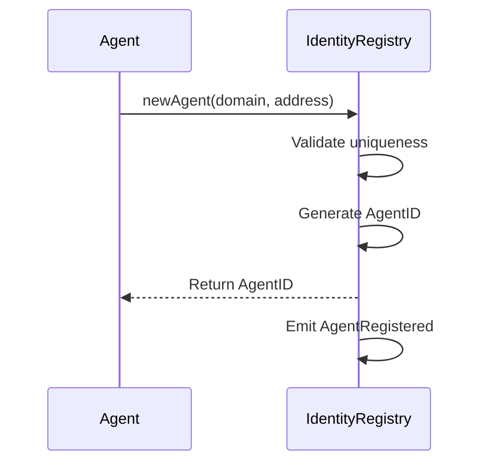
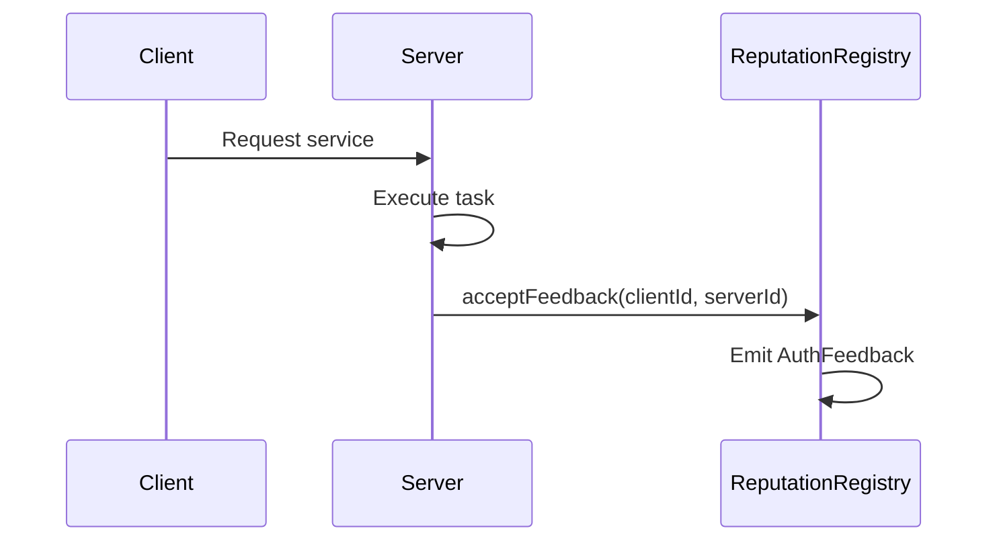
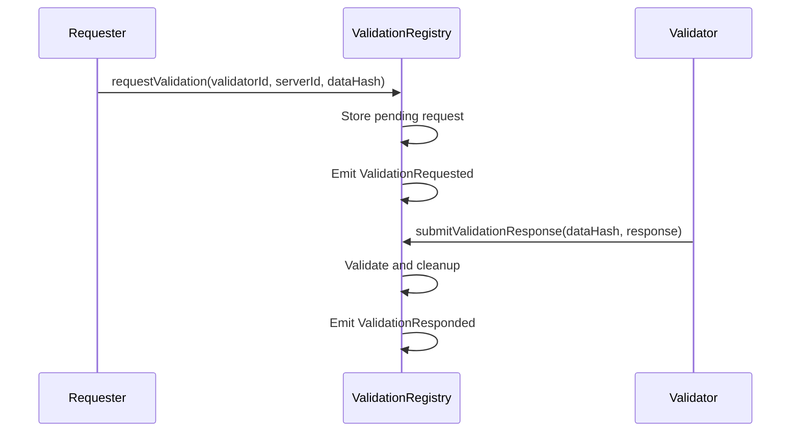

# ERC-8004 Implementation Guide

This guide provides a comprehensive overview of the ERC-8004: Trustless Agents implementation, including architecture details, contract specifications, deployment guidance, and integration patterns.

## Table of Contents

1. [Architecture Overview](#architecture-overview)
2. [Core Contracts](#core-contracts)
   - [Identity Registry](#identity-registry)
   - [Reputation Registry](#reputation-registry)
   - [Validation Registry](#validation-registry)
3. [Complete Protocol Usage Workflow](#complete-protocol-usage-workflow)
4. [Off-Chain Integration](#off-chain-integration)
5. [Agent Lifecycle](#agent-lifecycle)
6. [Integration Patterns](#integration-patterns)
7. [Deployment Guide](#deployment-guide)
8. [Security Considerations](#security-considerations)
9. [Gas Optimization](#gas-optimization)
10. [Testing](#testing)

## Architecture Overview

The ERC-8004 implementation follows a modular design with three core contracts that work together to provide a complete trustless agent ecosystem supporting three distinct participant roles.

### Agent Roles

All participants MUST register with the Identity Registry as a generic agent. The system supports three complementary roles that can be assigned dynamically:

- **Server Agent (A2A Server)**: Offers services and executes tasks for other agents
- **Client Agent (A2A Client)**: Assigns tasks to Server Agents and provides feedback on completed work
- **Validator Agent (Optional)**: Validates tasks through crypto-economic staking mechanisms or cryptographic verification (TEE attestations)

**Important**: Agents may fulfill multiple roles simultaneously without restriction, using a bitmap system for efficient role management.

### Contract Architecture

```text
┌─────────────────────┐    ┌─────────────────────┐    ┌─────────────────────┐
│   Identity Registry │    │ Reputation Registry │    │ Validation Registry │
│                     │    │                     │    │                     │
│ • Agent Registration│    │ • Feedback Auth     │    │ • Task Validation   │
│ • Identity Resolution│   │ • Event Emission    │    │ • Crypto-Economic   │
│ • Access Control    │    │ • Off-chain Data    │    │ • TEE Attestations  │
└─────────────────────┘    └─────────────────────┘    └─────────────────────┘
           │                           │                           │
           │                           │                           │
           └───────────────────────────┼───────────────────────────┘
                                       │
                              ┌─────────────────────┐
                              │    Agent Identity   │
                              │                     │
                              │ AgentID → Domain    │
                              │ AgentID → Agent+Owner │
                              │ Domain → AgentID    │
                              │ AgentAddr → AgentID │
                              └─────────────────────┘
```

### Design Principles

- **Interface-Driven Architecture**: All contracts implement corresponding interfaces for maximum flexibility
- **Event-Based Integration**: On-chain events point to detailed off-chain data to minimize gas costs
- **Minimal On-Chain Storage**: Only essential data is stored on-chain, with comprehensive data stored off-chain
- **Access Control**: Owner addresses must authorize agent registrations and updates
- **Gas Optimization**: Assembly optimizations and efficient storage patterns reduce transaction costs

## Core Contracts

### Identity Registry

The **IdentityRegistry** contract serves as the central hub for agent identity management in the ERC-8004 ecosystem.

#### Key Features

- **Unique Agent IDs**: Auto-incrementing counter ensures globally unique identifiers
- **Role Management**: Bitmap-based system allowing multiple simultaneous roles per agent
- **Bidirectional Resolution**: Resolve agents by ID, domain, or address
- **Ownership Control**: Only agent owners can update their information and manage roles
- **Domain Uniqueness**: Prevents duplicate domains across the registry
- **RFC 8615 Compliance**: Agent domains must serve Agent Cards at the well-known URI `https://{AgentDomain}/.well-known/agent-card.json`

#### Data Structures

```solidity
enum Role {
    SERVER,     // = 0 → bitmap: 001 (value 1) - Offers services and executes tasks
    CLIENT,     // = 1 → bitmap: 010 (value 2) - Assigns tasks and provides feedback  
    VALIDATOR   // = 2 → bitmap: 100 (value 4) - Validates tasks through crypto-economic or cryptographic verification
}

struct Agent {
    uint256 id;           // Unique identifier (AgentID)
    string domain;        // Domain for off-chain AgentCard
    address agentAddress; // The EVM address identifying the agent
    address owner;        // The address that controls the agent
    uint8 roles;          // Bitmap representing the agent's roles (SERVER=1, CLIENT=2, VALIDATOR=4)
}
```

#### Role Management System

The registry uses a bitmap system for efficient role management:
- **Multiple Roles**: Agents can have any combination of SERVER, CLIENT, and VALIDATOR roles
- **Bitmap Storage**: Single `uint8` stores all role combinations (e.g., 7 = all roles, 3 = SERVER+CLIENT)
- **Gas Efficient**: Bitwise operations for adding/removing roles minimize gas costs
- **Flexible**: New roles can be added without restructuring existing data

#### Core Functions

##### Registration

```solidity
function newAgent(string calldata agentDomain, address agentAddress) 
    external returns (uint256 agentId)
```

- Creates new agent identity
- Validates domain and agentAddress uniqueness  
- Enforces agent-controlled registration (msg.sender must equal agentAddress, and becomes the owner)
- Emits `AgentRegistered` event with all address information

##### Updates
```solidity
function updateAgent(
    uint256 agentId, 
    string calldata newAgentDomain, 
    address newAgentAddress
) external returns (bool success)
```

- Updates agent domain and/or address
- Validates ownership permissions
- Maintains mapping consistency
- Emits `AgentUpdated` event

##### Resolution Functions
- `getAgent(uint256 agentId)`: Direct ID lookup
- `resolveByDomain(string calldata agentDomain)`: Domain-based resolution
- `resolveByAddress(address agentAddress)`: Address-based resolution

##### Owner Resolution Functions
The registry provides additional utility functions for retrieving owner information:

- `getAgentOwner(uint256 agentId)`: Returns the owner address for a given agent ID
- `getOwnerByAgentAddress(address agentAddress)`: Returns the owner address for a given agent address
- `getOwnerByDomain(string calldata agentDomain)`: Returns the owner address for a given agent domain

##### Role Management Functions
The registry provides comprehensive role management capabilities:

```solidity
function addRole(uint256 agentId, Role role) external
function removeRole(uint256 agentId, Role role) external  
function hasRole(uint256 agentId, Role role) external view returns (bool)
function getRoles(uint256 agentId) external view returns (uint8)
function setRoles(uint256 agentId, uint8 roles) external
```

**Role Examples**:
- **Server Only**: `setRoles(agentId, 1)` → 001 bitmap
- **Client Only**: `setRoles(agentId, 2)` → 010 bitmap  
- **Server + Client**: `setRoles(agentId, 3)` → 011 bitmap
- **All Roles**: `setRoles(agentId, 7)` → 111 bitmap

**Access Control**: Only the agent owner can modify roles, ensuring security and preventing unauthorized role changes.

#### State Management

The contract maintains four key mappings for efficient lookups:

```solidity
mapping(uint256 => Agent) private _agents;              // ID → Agent
mapping(string => uint256) private _domainToAgentId;    // Domain → ID  
mapping(address => uint256) private _addressToAgentId;  // AgentAddress → ID
mapping(address => uint256) private _ownerToAgentId;    // Owner → ID
```

### Reputation Registry

The **ReputationRegistry** provides a lightweight mechanism for authorizing and tracking feedback between agents with enhanced security and access control.

#### Key Features

- **Access Control**: Only agent owners can authorize feedback for their server agents
- **Identity Integration**: Integrates with IdentityRegistry for agent ownership verification
- **Pre-Authorization**: Server agents authorize clients to provide feedback
- **Event-Driven**: Emits events pointing to off-chain detailed feedback
- **Gas Efficient**: Minimal on-chain storage with standard Solidity operations
- **Unique Identifiers**: Cryptographically secure feedback authorization IDs

#### Constructor

```solidity
constructor(IIdentityRegistry _identityRegistry)
```

- Requires IdentityRegistry address for agent ownership verification
- Immutable reference ensures consistent access control throughout contract lifecycle

#### Core Functions

##### Feedback Authorization

```solidity
function acceptFeedback(uint256 agentClientId, uint256 agentServerId) external
```

- **Access Control**: Verifies that `msg.sender` is the owner of the server agent
- **Identity Verification**: Calls `identityRegistry.getAgentOwner(agentServerId)` to validate ownership
- **Role Verification**: 
  - Server agent must have `SERVER` role
  - Client agent must have `CLIENT` role
- **Pre-authorizes** feedback relationship between client and server agents
- **Generates unique** `feedbackAuthId` using comprehensive hash inputs
- **Emits** `AuthFeedback` event for off-chain indexing

#### FeedbackAuthID Generation

The contract generates secure, unique feedback authorization IDs using:

```solidity
bytes32 feedbackAuthId = keccak256(abi.encodePacked(
    block.chainid,     // Chain ID for replay protection
    address(this),     // Contract address for uniqueness
    counter,           // Incrementing counter for ordering
    agentClientId,     // Client agent identifier
    agentServerId      // Server agent identifier
));
```

This comprehensive approach ensures:
- **Global Uniqueness**: Combination of chain, contract, counter, and agent IDs
- **Replay Protection**: Chain ID prevents cross-chain replay attacks
- **Agent Specificity**: Client and server IDs make each authorization unique to the agent pair
- **Temporal Ordering**: Counter provides chronological sequence

### Validation Registry

The **ValidationRegistry** is a system that enables independent verification of the quality and accuracy of tasks performed by agents. It acts as an external "quality controller" for the trustless agent ecosystem.

#### System Architecture

The ValidationRegistry provides two main functions:
```solidity
ValidationRequest(AgentValidatorID, AgentServerID, DataHash)
ValidationResponse(DataHash, Response)
```

#### Key Features

- **Access Control**: Only agent owners can request validation for their server agents
- **Independent Quality Control**: External validators verify task completeness and accuracy
- **Time-Limited Requests**: Validation requests expire after TTL period to prevent indefinite pending states
- **Identity Integration**: Integrates with IdentityRegistry for agent ownership and validator authorization
- **Flexible Validation**: Supports both crypto-economic staking and cryptographic verification models
- **Graduated Scoring**: Response scores from 0-100 allow nuanced quality assessment
- **State Cleanup**: Automatic cleanup prevents storage bloat

#### Data Structures

```solidity
struct PendingValidation {
    uint256 agentValidatorId;      // Validator agent ID
    uint256 agentServerId;         // Server agent ID
    uint256 expirationTimestamp;   // Request expiration time
}
```

#### Core Functions

##### Validation Request

```solidity
function requestValidation(
    uint256 agentValidatorId, 
    uint256 agentServerId, 
    bytes32 dataHash
) external
```

- **Access Control**: Verifies that `msg.sender` is the owner of the server agent
- **Identity Verification**: Calls `identityRegistry.getAgentOwner(agentServerId)` to validate ownership
- **Role Verification**: 
  - Server agent must have `SERVER` role
  - Validator agent must have `VALIDATOR` role
- Creates validation request with TTL
- Prevents duplicate requests for same data hash
- Emits `ValidationRequested` event

##### Validation Response

```solidity
function submitValidationResponse(bytes32 dataHash, uint8 response) external
```

- **Access Control**: Validates caller is the designated validator address
- **Role Verification**: Validator agent must have `VALIDATOR` role
- **Response Validation**: Enforces response range (0-100)
- **State Cleanup**: Cleans up state after response
- **Event Emission**: Emits `ValidationResponded` event

#### Time-to-Live Management

Validation requests automatically expire after `PENDING_REQUEST_TTL` (1 hour by default), preventing indefinite state accumulation and ensuring timely validation responses.

### Validation Scenarios

The ValidationRegistry supports two primary validation models, each suited for different use cases:

#### Step-by-Step Validation Flow

##### 1. Validation Request
When a Server Agent completes a task, it can request validation:
```solidity
ValidationRequest(ValidatorID, ServerID, DataHash)
```

**Example**: 
- Server Agent #456 completes a medical analysis
- Requests validation from Validator Agent #789  
- Call: `ValidationRequest(789, 456, "0xabc123hash")`
- Contract stores this request for X seconds

##### 2. Validation Processing
The validator examines the task and responds:
```solidity
ValidationResponse(DataHash, Response)
```

**Response Scoring**:
- Response is a score from 0 to 100
- 0 = complete failure, 100 = perfect execution  
- Can be binary (0 or 100) or graduated (e.g., 85)

#### Validation Model 1: Crypto-Economic Verification 🏦

In this model, the validator agent re-executes the task to verify the result.

**Example: Translation Validation**

```json
// DataHash points to:
{
  "input": "Bonjour, comment allez-vous ?",
  "expectedOutput": "Hello, how are you?", 
  "task": "french-to-english-translation",
  "serverAgent": 456
}
```

**Process**:
- **Validator**: Agent #789 (independent validation service)
- **Method**: Validator re-translates the French text
- **Comparison**: Compares its translation with server agent's output
- **Score**: 95/100 (excellent translation, minor nuance missed)

#### Validation Model 2: Cryptographic Verification 🔐

In this model, the validator verifies cryptographic proof (TEE, zkTLS).

**Example: Secure API Request Validation**

```json
// DataHash points to:
{
  "apiEndpoint": "https://api.weather.com/current",
  "teeAttestation": "0xproof123...",
  "timestamp": "2024-08-28T10:00:00Z", 
  "result": "Temperature: 25°C, Humidity: 60%"
}
```

**Process**:
- **Validator**: Smart contract verification system
- **Method**: Automatically verifies TEE proof
- **Verification**: Confirms data actually came from weather API
- **Score**: 100/100 (valid cryptographic proof)

#### Off-Chain Data Structures

##### Validation Requests (Server Agent)
Server Agent Cards MUST include a ValidationRequestsURI:

```json
// File pointed to by ValidationRequestsURI
{
  "0xabc123hash": "https://example.com/validation-request-1.json",
  "0xdef456hash": "https://example.com/validation-request-2.json"
}
```

**Individual Request Content**:
```json
// validation-request-1.json
{
  "AgentSkillId": "medical-diagnosis",
  "TaskId": "patient-analysis-001", 
  "contextId": "cardiology-consultation",
  "inputData": "Patient symptoms: chest pain, shortness of breath",
  "outputData": "Diagnosis: Possible angina, recommend ECG",
  "validationType": "medical-peer-review"
}
```

##### Validation Responses (Validator Agent)  
Validator Agent Cards MUST include a ValidationResponsesURI:

```json
// File pointed to by ValidationResponsesURI
{
  "0xabc123hash": "https://validator.com/response-1.json",
  "0xdef456hash": "https://validator.com/response-2.json"
}
```

**Individual Response Content**:
```json
// response-1.json
{
  "score": 92,
  "evidence": {
    "validatorCredentials": "Board-certified cardiologist",
    "reviewTime": "45 minutes", 
    "additionalTests": "ECG recommended - appropriate",
    "diagnosticAccuracy": "High confidence in assessment"
  },
  "timestamp": "2024-08-28T11:30:00Z",
  "validatorSignature": "0xvalidation_proof..."
}
```

#### Complete Usage Examples

##### Example 1: Medical Diagnosis Validation

- **Task**: Medical Agent #123 diagnoses a patient
- **Request**: `ValidationRequest(doctor_validator_789, 123, patient_file_hash)`
- **Validation**: Expert human doctor examines the case file
- **Response**: `ValidationResponse(patient_file_hash, 88)` - Good diagnosis but additional tests recommended

##### Example 2: Financial Transaction Validation  

- **Task**: Financial Agent #456 calculates investment risk
- **Request**: `ValidationRequest(tee_validator_999, 456, calculation_hash)`
- **Validation**: Secure execution environment (TEE) re-calculates
- **Response**: `ValidationResponse(calculation_hash, 100)` - Calculation cryptographically verified

##### Example 3: Graduated Validation

- **Task**: Technical document translation
- **Validation**: Linguistic expert evaluates multiple criteria
- **Detailed Scoring**:
  - Terminology accuracy: 95/100
  - Fluency: 78/100
  - Context respect: 92/100  
  - **Final Score**: 88/100

## Complete Protocol Usage Workflow

This section provides a comprehensive, step-by-step workflow demonstrating how the ERC-8004 protocol operates in practice, from initial deployment to a fully functional trustless agent marketplace.

### Phase 1: Protocol Initialization

#### Step 1.1: Contract Deployment
```solidity
// Deploy contracts in dependency order
IdentityRegistry identityRegistry = new IdentityRegistry();
ReputationRegistry reputationRegistry = new ReputationRegistry(address(identityRegistry));
ValidationRegistry validationRegistry = new ValidationRegistry(address(identityRegistry));
```

#### Step 1.2: Protocol Configuration
- Configure validation TTL parameters
- Set up monitoring and indexing services
- Deploy optional governance contracts

### Phase 2: Agent Ecosystem Bootstrap

#### Step 2.1: Server Agent Registration

**Scenario**: SecurityCorp wants to offer smart contract auditing services.

1. **On-Chain Registration**:
   ```solidity
   // SecurityCorp calls (msg.sender must equal agentAddress)
   uint256 serverAgentId = identityRegistry.newAgent(
       "security-audit.quantpulsar.ai", 
       0x742d35Cc6634C0532925a3b844Bc9e7595f0bEb7
   );
   // Returns: agentId = 1
   ```

2. **Off-Chain Agent Card Deployment**:
   Deploy Agent Card at: `https://security-audit.quantpulsar.ai/.well-known/agent-card.json`
   ```json
   {
     "version": "1.0",
     "agent": {
       "name": "SecurityCorp Audit Agent",
       "capabilities": ["vulnerability-detection", "gas-optimization"]
     },
     "registrations": [{
       "agentId": 1,
       "agentAddress": "eip155:1:0x742d35Cc6634C0532925a3b844Bc9e7595f0bEb7",
       "signature": "0x1b2c3d..."
     }],
     "trustModels": ["feedback", "tee-attestation"],
     "endpoints": {
       "api": "https://api.security-audit.quantpulsar.ai"
     }
   }
   ```

#### Step 2.2: Client Agent Registration

**Scenario**: DeFiStartup needs security auditing for their new protocol.

1. **On-Chain Registration**:
   ```solidity
   uint256 clientAgentId = identityRegistry.newAgent(
       "defi-startup.com",
       0x9876543210abcdef1234567890abcdef12345678
   );
   // Returns: agentId = 2
   ```

2. **Agent Card with Feedback URI**:
   ```json
   {
     "version": "1.0",
     "agent": {
       "name": "DeFiStartup Protocol Team",
       "capabilities": ["protocol-development"]
     },
     "registrations": [{
       "agentId": 2,
       "agentAddress": "eip155:1:0x9876543210abcdef1234567890abcdef12345678"
     }],
     "trustModels": ["feedback"],
     "feedbackDataURI": "https://defi-startup.com/feedback/"
   }
   ```

#### Step 2.3: Validator Agent Registration

**Scenario**: ExpertValidators provides independent code review services.

1. **On-Chain Registration**:
   ```solidity
   uint256 validatorAgentId = identityRegistry.newAgent(
       "expert-validators.com",
       0xabcdef1234567890abcdef1234567890abcdef12
   );
   // Returns: agentId = 3
   ```

2. **Validator Agent Card**:
   ```json
   {
     "version": "1.0",
     "agent": {
       "name": "ExpertValidators Independent Review",
       "capabilities": ["code-review", "security-validation"]
     },
     "registrations": [{
       "agentId": 3,
       "agentAddress": "eip155:1:0xabcdef1234567890abcdef1234567890abcdef12"
     }],
     "trustModels": ["tee-attestation"],
     "validationResponsesURI": "https://expert-validators.com/responses/"
   }
   ```

### Phase 3: Service Discovery and Trust Evaluation

#### Step 3.1: Client Discovery Process

1. **Registry Query**: DeFiStartup searches for security auditors
   ```solidity
   // Query by capability or browse registry events
   // Discover SecurityCorp (Agent ID: 1)
   (uint256 id, string memory domain, address agentAddr) = 
       identityRegistry.resolveByDomain("security-audit.quantpulsar.ai");
   ```

2. **Agent Card Analysis**: 
   - Fetch `https://security-audit.quantpulsar.ai/.well-known/agent-card.json`
   - Evaluate capabilities, trust models, and endpoints
   - Check reputation data and past feedback

3. **Trust Model Assessment**:
   - Review supported trust models: `["feedback", "tee-attestation"]`
   - Evaluate past client feedback
   - Consider validation history

#### Step 3.2: Service Negotiation (Off-Chain)

1. **Initial Contact**: DeFiStartup contacts SecurityCorp via API endpoint
2. **Scope Definition**: Define audit scope, timeline, and deliverables
3. **Agreement**: Establish service level agreement and payment terms

### Phase 4: Service Execution with Trust Mechanisms

#### Step 4.1: Pre-Authorization Setup

SecurityCorp (Server Agent) pre-authorizes feedback from DeFiStartup (Client Agent):

```solidity
// SecurityCorp owner calls (must be agent owner)
reputationRegistry.acceptFeedback(2, 1); // (clientId=2, serverId=1)

// Emits: AuthFeedback(2, 1, 0xfeedbackAuthId123...)
```

#### Step 4.2: Optional Validation Request

SecurityCorp requests independent validation of their audit work:

```solidity
// SecurityCorp requests validation from ExpertValidators
validationRegistry.requestValidation(
    3,                    // validatorId (ExpertValidators)
    1,                    // serverId (SecurityCorp) 
    0xauditReportHash... // hash of audit deliverables
);

// Emits: ValidationRequested(3, 1, 0xauditReportHash..., block.timestamp + TTL)
```

#### Step 4.3: Task Execution

1. **Service Delivery**: SecurityCorp performs comprehensive smart contract audit
2. **Deliverable Creation**: Generate detailed audit report with findings
3. **Quality Assurance**: Internal review before client delivery

#### Step 4.4: Independent Validation (Optional)

1. **Validator Review**: ExpertValidators examines SecurityCorp's audit work
   
2. **Off-Chain Validation Data**: ExpertValidators creates detailed review
   ```json
   {
     "score": 94,
     "evidence": {
       "validatorCredentials": "Certified Smart Contract Auditor, 5+ years",
       "reviewTime": "8 hours",
       "methodology": "Independent code review with automated tools",
       "findings": "Comprehensive analysis, missed 1 minor optimization"
     },
     "timestamp": "2024-08-28T15:30:00Z"
   }
   ```

3. **On-Chain Validation Response**:
   ```solidity
   // ExpertValidators submits validation score
   validationRegistry.submitValidationResponse(
       0xauditReportHash..., 
       94  // Score: 94/100
   );
   
   // Emits: ValidationResponded(3, 1, 0xauditReportHash..., 94)
   ```

### Phase 5: Feedback and Reputation Building

#### Step 5.1: Client Feedback Publication

1. **Off-Chain Feedback Creation**: DeFiStartup creates detailed feedback
   ```json
   {
     "FeedbackAuthID": "eip155:1:0xfeedbackAuthId123...",
     "AgentSkillId": "smart-contract-audit",
     "TaskId": "defi-protocol-audit-001",
     "Rating": 92,
     "ProofOfPayment": {
       "txHash": "0x456def...",
       "amount": "5 ETH"
     },
     "Data": {
       "thoroughness": "excellent",
       "timeDelivered": "on-schedule",
       "communication": "responsive",
       "findings": "identified 3 critical vulnerabilities"
     }
   }
   ```

2. **Feedback Publication**: Store at `https://defi-startup.com/feedback/0xfeedbackAuthId123.json`

#### Step 5.2: Reputation Aggregation

1. **Feedback Indexing**: Protocol indexers collect feedback data
2. **Reputation Scoring**: Aggregate ratings across multiple dimensions
3. **Trust Network Building**: Build trust relationships between agents

### Phase 6: Ecosystem Growth and Specialization

#### Step 6.1: Specialized Agent Emergence

As the ecosystem matures, specialized agents emerge:

- **Gas Optimization Specialists**: Focus on contract efficiency
- **DeFi Security Experts**: Specialized in DeFi protocol risks  
- **Multi-Chain Validators**: Cross-chain validation services
- **Reputation Aggregators**: Trust scoring and recommendation services

#### Step 6.2: Network Effects

1. **Quality Differentiation**: High-quality agents build strong reputations
2. **Niche Specialization**: Agents develop domain expertise
3. **Validation Networks**: Trusted validator pools emerge
4. **Client Segmentation**: Different client types prefer different trust models

#### Step 6.3: Advanced Trust Models

1. **Staking Mechanisms**: Agents stake tokens to bond their reputation
2. **Insurance Integration**: Coverage for service failures
3. **Multi-Party Validation**: Complex tasks requiring multiple validators
4. **Automated Quality Gates**: Smart contract-enforced quality standards

### Phase 7: Continuous Ecosystem Evolution

#### Step 7.1: Iterative Improvement

- **Agent Learning**: Agents improve based on feedback
- **Protocol Upgrades**: System enhancements and new features
- **Standard Evolution**: A2A protocol extensions and improvements

#### Step 7.2: Cross-Protocol Integration

- **Multi-Chain Expansion**: Deploy across multiple blockchains
- **Interoperability**: Bridge different agent ecosystems  
- **Standard Adoption**: Integration with other trustless systems

### Workflow Summary

This complete workflow demonstrates how the ERC-8004 protocol enables:

1. **Decentralized Identity**: Agents self-register and maintain their identity
2. **Trust Building**: Multiple trust mechanisms (feedback, validation, attestation)
3. **Quality Assurance**: Independent validation ensures service quality
4. **Reputation Systems**: Long-term reputation building drives quality
5. **Market Efficiency**: Discovery and matching of agents and services
6. **Ecosystem Growth**: Network effects drive adoption and specialization

The protocol creates a self-sustaining marketplace where trust is built through verifiable on-chain mechanisms, enabling truly trustless interactions between autonomous agents.

## Off-Chain Integration

The ERC-8004 standard extends beyond smart contracts to include off-chain components that enable agent discovery and trust establishment.

### Agent Card Requirement

All registered agents **MUST** serve an Agent Card at the RFC 8615 well-known URI:
```
https://{AgentDomain}/.well-known/agent-card.json
```

### Agent Card Overview

Agent Cards provide:
- **Registration Proofs**: Cryptographic proof of blockchain registrations
- **Trust Models**: Supported validation and reputation mechanisms  
- **Service Endpoints**: API and communication endpoints
- **Capabilities**: Agent-specific functionality and specializations

For complete Agent Card specifications, schemas, and examples, see: **[AGENT_CARD_SPECIFICATION.md](./AGENT_CARD_SPECIFICATION.md)**

## Agent Lifecycle

Understanding the complete agent lifecycle is crucial for successful integration:

### 1. Registration Phase



### 2. Operational Phase

##### Service Provision (Server Agent)



##### Validation Request



### 3. Update Phase

Agents can update their information while maintaining identity continuity:
- **Domain changes** for rebranding or organizational changes
- **Agent address changes** for operational key rotation or infrastructure updates
- **Owner address changes** for control transfer or multi-sig updates
- **Ownership verification** ensures only current ownerAddress can authorize updates
- **Flexible updates** allow changing individual fields without affecting others

## Integration Patterns

### Pattern 1: Basic Agent Registration

```solidity
// Deploy contracts
IdentityRegistry identityRegistry = new IdentityRegistry();
ReputationRegistry reputationRegistry = new ReputationRegistry(address(identityRegistry));
ValidationRegistry validationRegistry = new ValidationRegistry(address(identityRegistry));

// Register agent (msg.sender becomes owner and must equal agentAddress)
uint256 agentId = identityRegistry.newAgent("example.com", agentAddress);
```

### Pattern 2: Service Provider Integration

```solidity
contract ServiceProvider {
    IIdentityRegistry immutable IDENTITY_REGISTRY;
    IReputationRegistry immutable REPUTATION_REGISTRY;
    
    constructor(address _identityRegistry, address _reputationRegistry) {
        IDENTITY_REGISTRY = IIdentityRegistry(_identityRegistry);
        REPUTATION_REGISTRY = IReputationRegistry(_reputationRegistry);
    }
    
    function completeTask(uint256 clientAgentId) external {
        // Service logic here
        
        // Authorize feedback (resolveByAddress returns: id, domain, agentAddress)
        (uint256 serverAgentId, , ) = IDENTITY_REGISTRY.resolveByAddress(msg.sender);
        REPUTATION_REGISTRY.acceptFeedback(clientAgentId, serverAgentId);
    }
}
```

### Pattern 3: Validation Integration

```solidity
contract TaskValidator {
    IValidationRegistry immutable VALIDATION_REGISTRY;
    
    function requestTaskValidation(
        uint256 validatorAgentId,
        uint256 serverAgentId,
        bytes calldata taskData
    ) external {
        bytes32 dataHash = keccak256(taskData);
        VALIDATION_REGISTRY.requestValidation(validatorAgentId, serverAgentId, dataHash);
    }
}
```

## Deployment Guide

### Prerequisites

1. **Solidity Version**: ^0.8.30
2. **Foundry Toolchain**: Latest version
3. **Network Configuration**: Configure for target blockchain

### Deployment Sequence

The contracts must be deployed in the correct order due to dependencies:

```bash
# 1. Deploy IdentityRegistry (no dependencies)
forge create src/IdentityRegistry.sol:IdentityRegistry --private-key $PRIVATE_KEY

# 2. Deploy ReputationRegistry (depends on IdentityRegistry)
forge create src/ReputationRegistry.sol:ReputationRegistry \
    --constructor-args $IDENTITY_REGISTRY_ADDRESS \
    --private-key $PRIVATE_KEY

# 3. Deploy ValidationRegistry (depends on IdentityRegistry)
forge create src/ValidationRegistry.sol:ValidationRegistry \
    --constructor-args $IDENTITY_REGISTRY_ADDRESS \
    --private-key $PRIVATE_KEY
```

### Verification

After deployment, verify the contracts on block explorers:

```bash
# Example for Etherscan
forge verify-contract $CONTRACT_ADDRESS src/IdentityRegistry.sol:IdentityRegistry \
    --etherscan-api-key $ETHERSCAN_API_KEY \
    --chain-id $CHAIN_ID
```

### Configuration

Consider the following configuration parameters:

- **ValidationRegistry TTL**: Default 1 hour, adjust based on validation requirements
- **Gas Price Strategy**: Optimize for network conditions
- **Access Control**: Consider additional permission layers for production

## Security Considerations

### Identity Security

1. **Agent-Controlled Registration**: Only agents can register themselves (msg.sender must equal agentAddress, and becomes the owner)
2. **Ownership Verification**: Updates require current owner authorization  
3. **Owner/Agent Separation**: Agent addresses (for identification) are separate from owner addresses (for control)
4. **Uniqueness Constraints**: Prevents domain and agentAddress conflicts across all registrations

### Reputation Security

1. **Authorization Model**: Pre-authorization prevents unauthorized feedback
2. **Replay Protection**: Chain ID and contract address in hash
3. **Event Integrity**: Immutable on-chain event log

### Validation Security

1. **Time Bounds**: TTL prevents indefinite pending states
2. **Authority Validation**: Only designated validators can respond
3. **State Cleanup**: Prevents storage-based attacks

### General Security Practices

- **Reentrancy Protection**: Not required due to design but consider for extensions
- **Integer Overflow**: Solidity ^0.8.30 provides built-in protection
- **Access Control**: Implement role-based permissions for sensitive operations
- **Upgradeability**: Consider proxy patterns for future upgrades

## Gas Optimization

### Assembly Usage

The ReputationRegistry uses assembly for hash generation:
- **Gas Savings**: ~200 gas saved per call compared to `abi.encodePacked`
- **Security**: Maintains cryptographic security properties
- **Readability**: Well-commented assembly code

### Storage Patterns

- **Packed Structs**: Minimize storage slots where possible
- **Mapping Efficiency**: Use mappings for O(1) lookups
- **State Cleanup**: Delete storage after use in ValidationRegistry

### Event Optimization

- **Indexed Parameters**: Up to 3 indexed parameters for efficient filtering
- **Off-chain Data**: Store comprehensive data off-chain, reference via events

## Testing

### Test Structure

```text
test/
├── IdentityRegistry.t.sol      # Identity management tests
├── ReputationRegistry.t.sol    # Reputation system tests
└── ValidationRegistry.t.sol    # Validation mechanism tests
```

### Key Test Scenarios

##### Identity Registry Tests

- Agent registration with valid parameters
- Duplicate domain/address rejection
- Authorization enforcement for updates
- Resolution function accuracy

##### Reputation Registry Tests

- Feedback authorization flow
- Event emission verification
- Gas consumption benchmarks

##### Validation Registry Tests

- Request/response lifecycle
- TTL expiration handling
- Authorization validation
- State cleanup verification

### Running Tests

```bash
# Run all tests
forge test

# Run with verbosity for debugging
forge test -vvv

# Run specific test file
forge test --match-path test/IdentityRegistry.t.sol

# Generate gas snapshots
forge snapshot
```

### Test Coverage

Maintain comprehensive test coverage focusing on:

- **Happy Path**: Normal operation scenarios
- **Edge Cases**: Boundary conditions and error states
- **Security**: Authorization and access control
- **Gas Usage**: Performance benchmarks

## Conclusion

This implementation provides a robust foundation for trustless agent marketplaces. The modular design allows for flexible integration while maintaining security and efficiency. Key benefits include:

- **Scalability**: Efficient storage and gas patterns support large-scale adoption
- **Security**: Comprehensive access controls and validation mechanisms
- **Flexibility**: Interface-driven design enables diverse integration patterns
- **Cost-Effectiveness**: Assembly optimizations and minimal on-chain storage reduce operational costs

For additional support or questions about implementation details, refer to the contract source code and comprehensive test suite.
